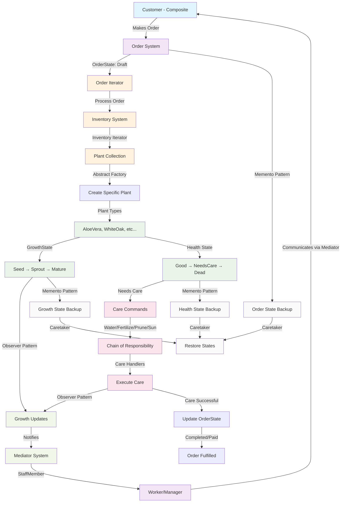

# 🌱 COS 214 - Plant Nursery Management System


## 🌱 Branch Structure

- **`main`** - Production-ready code with final implementation
- **`dev`** - Development branch for ongoing work
- **Feature Branches** - Individual feature development

## 📊 Project Overview

This C++ project implements a comprehensive plant nursery management system for COS 214, showcasing object-oriented design principles and software design patterns in C++.
It involves a variety of features and interactions, such as being able to view plants, create orders and take care and monitor plant growth and many more.
We as a team of 7 distributed an even workload in which each team member all contirbuted in building this fully functional system as all as the related documentation and diagrams to follow with it.

## 🗂️ Project Structure (Main Branch)

- note the header and cpp files are not expilicty listed as we have over 140, this just gives the general structure of everything

```
Plant-Nursery-Management-System/
├── 📁 documentation/
│   ├── 📄 Project_Report.pdf
│   ├── 📄 Presentation_Slides.pptx
│   └── 📁 Diagrams/
├── 📁 include/
├── 📁 src/
├── 📄 Makefile
├── 📄 .gitignore
└── 📄 README.md
```

## 📋 UML Diagrams

### Structural Diagrams
- [**Class Diagram**](./Documentation/Diagrams/class_Diagram_final.jpg) - System class structure and relationships
- [**Object Diagram**](./Documentation/Diagrams/Object%20Diagram.jpg) - Runtime object instances and links
- [**Communication Diagram**](./Documentation/Diagrams/Communication%20Diagram.jpg) - Object interactions and messaging

### Behavioral Diagrams
- [**Sequence Diagrams**](./Documentation/Diagrams/Sequence%20Diagram.jpg) - Time-ordered object interactions
- [**State Machine Diagram**](./Documentation/Diagrams/State%20Machine%20Diagram.pdf) - Object state transitions
- [**Activity Diagram**](./Documentation/Diagrams/Activity%2diagram%2final.jpg) - Business process workflows

## 📋 Documentation

### Powerpoint 

### Functional Requirements

### Doxygen 

- the command `make doxygen` will generate comprehensive docs on each of the classes, their methods, and interactions.

## 👥 Team Members & Contributions

| Team Member | Role & Focus | Key Contributions | Design Patterns & Features |
|-------------|--------------|-------------------|----------------------------|
| **Ayush Beekum** | *Structural Foundations & Creational Patterns* | - Object Diagram design<br>- Plant creation systems | **Abstract Factory**: Factory interfaces for plant families<br>**Decorator**: Flexible plant enhancements<br>**Prototype**: Efficient plant cloning |
| **Diya Narotam** | *Plant Lifecycle Management* | - Class Diagram design<br>- Plant health & growth systems | **State - HealthState**: Dynamic transitions (Good → NeedsCare → Dead)<br>**State - GrowthState**: Growth progression (Seed → Sprout → Mature) |
| **Jaitin Moodally** | *Request Handling & Command System* | - Communication Diagram<br>- Plant care operations | **Command Pattern**: Encapsulated plant care operations<br>**Chain of Responsibility**: Sequential request handling<br>**Observer Pattern**: Monitors plant growth changes |
| **Shavir Vallabh** | *Data Access & Order Management* | - Sequence Diagram<br>- Plant collection traversal | **Iterator Pattern**: BST-based collection traversal<br>**State - OrderState**: Order lifecycle (Draft → Completed → Paid → Cancelled) |
| **Fabio Berrino** | *System Persistence & Demonstration* | - Activity Diagram<br>- System state management | **Memento Pattern**: Templatized state capture/restore<br>**DemoMain**: Comprehensive system demonstration |
| **Chinmayi Santosh** | *Communication Mediation* | - Class Diagram design<br>- Object communication | **Mediator Pattern**: Centralized worker-customer communications |
| **Mahadio Tlaka** | *Hierarchical Structures* | - State Machine Diagram<br>- Customer management | **Composite Pattern**: Customer grouping hierarchy |

---

## 🎯 Design Patterns Overview

This project demonstrates **10+ Game of Four design patterns** working in harmony to solve real-world plant nursery challenges:

- **Creational**:
  -  **Abstract Factory**: Dynamically create related plant types (e.g., `SucculentFactory`, `CarnivorousFactory`)
  -  **Prototype**: Efficiently clone plant objects to speed up inventory generation
  
- **Structural**:
  -  **Decorator**: Add dynamic behaviors to plants (e.g., "Potted", "Fertilized") without modifying core classes
  -  **Composite**: Allow for complex customer compositions and personalised discounts

- **Behavioral**:
  -  **State**: Track and transition plants' health and growth stages (e.g., **Seed → Mature**)
  -  **Command**: Encapsulate plant care actions (e.g., watering, fertilizing) for easy execution and scheduling
  -  **Chain of Responsibility**: Handle plant care requests in a flexible chain of operations
  -  **Iterator**: Traverse plant collections and perform batch operations
  -  **Memento**: Capture and restore system states for rollback and recovery
  -  **Mediator**: Centralize communication and interactions within the system
  -  **Observer**: Monitor plant status and notify relevant components of changes (e.g., growth, health)

Each pattern addresses specific domain problems in plant nursery management, maintaining a clean, extensible, and flexible architecture. 🌱


---

## 📊 System Performance

| Metric | Value | Impact |
|--------|-------|--------|
| **Plant Creation** | $O(1)$ via Abstract Factory | Rapid inventory expansion |
| **State Transitions** | $O(1)$ constant time | Real-time responsiveness |
| **Collection Traversal** | $O(n)$ via Iterators | Efficient inorder traversal |
| **Care Command Execution** | $O(1)$ with Chain of Responsibility | Scalable plant care system |
| **Plant Insertion** | $O(\log n)$ using BST | Efficient insertion & sorting |
| **Plant Deletion** | $O(\log n + m)$ | For n = number of nodes, and m = plants in a node |
| **Plant Seaching** | $O(\log n + m)$ | Essential for moving plants |

## 🎓 Academic & Professional Growth

### 💡 **Key Insights Gained**
- **Pattern Interplay**: How multiple patterns collaborate in real systems
- **C++ Mastery**: Advanced memory management and polymorphism
- **System Design**: Scalable architecture for complex domains
- **Team Coordination**: Large-scale collaborative development

### 🛠️ **Technical Skills Enhanced**
- UML Diagram Mastery (6 diagram types)
- C++ Design Pattern Implementation
- Version Control with Git
- Agile Development Practices
- Code Architecture & Documentation

---

## 🔄 System Workflow
- This shows just a snippet of what goes on in our system visualised through a workflow diagram



### Prerequisites⠀
- C++ Compiler (GCC, Clang, or MSVC) in version C++ 14
- The Ncurses library for demo TUI

### Getting Started
- Clone the repository: `https://github.com/Ayush-B99/COS-214-Final-Project/`
- A comprehensive makefile with commands for installing prerequisites, setting up a folder structure, and compiling is provided.
- Simply execute `make help` for a more detailed overview
- To install prerequisites, execute `make demo` to install the ncurses library. The script will automatically pick up your OS and execute the appropriate installation command.
- After prerequisites are installed, `make test` to compile and run the testing suite, or `make demo` to run the interactive interface.

## 🌟 Feedback & Testimonials

_"The use of design patterns in such a complex project is impressive. It’s clear that a lot of thought went into making the system both extensible and maintainable. This project should definitley earn a 110%"_  
— **Momina**, from Momina & Friends


